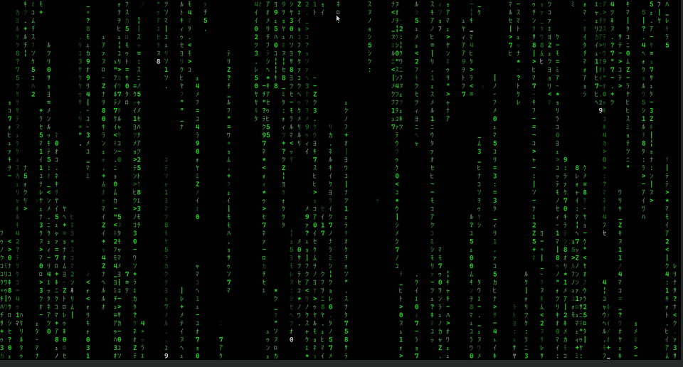
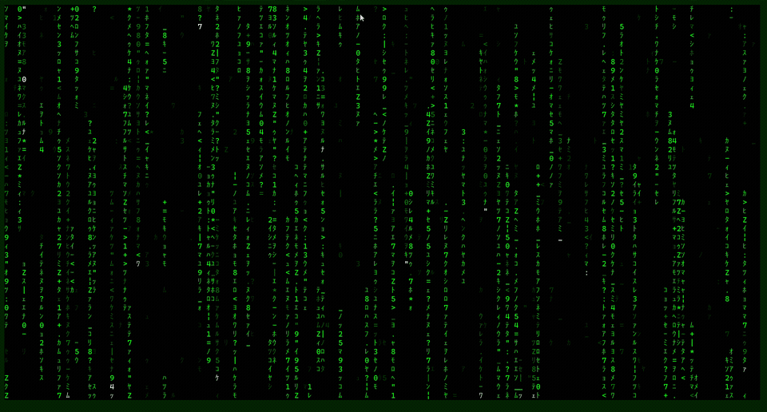

vim-matrix-screensaver
======================

Matrix digital-rain screensaver for Neovim.



Originally by [Don Yang](https://uguu.org) ([upstream](https://github.com/uguu-org/vim-matrix-screensaver)).
This fork rewrites the animation engine in Lua for Neovim and fixes rendering issues
from the original Vimscript version.

Features
--------

- Full-screen Matrix rain with stable green-on-black colors
- Movie glyph set (halfwidth katakana, numerals, symbols) or classic ASCII
- Density presets: sparse, balanced, or dense
- Optional auto-start after idle time
- Hidden cursor and command line while running
- Press any key or click the mouse to exit and restore your session
- Configurable via lazy.nvim `opts` or `vim.g.matrix`
- Headless test suite and GitHub Actions CI

Requirements
------------

- Neovim 0.5+ (0.11+ recommended for `vim.on_key` exit handling)

Install
-------

Clone into your Neovim data directory:

    git clone https://github.com/alexesba/vim-matrix-screensaver.git \
      ~/.local/share/nvim/site/pack/plugins/start/vim-matrix-screensaver

Or add the repository root to `runtimepath`.

Usage
-----

    :Matrix              " movie glyphs (default)
    :Matrix classic      " printable ASCII rain
    :Matrix movie 1 4    " optional: charset and delay range

Press any key or click to exit.



Command delay arguments override `min_delay` and `max_delay`. Both must be
positive integers and `maxdelay` must be greater than `mindelay`.

Configuration
-------------

Use **`opts`** with lazy.nvim (recommended), or **`vim.g.matrix`** for manual installs.
Settings reload each time you run `:Matrix`. Call `require('matrix').setup(opts)`
to apply auto-start changes without restarting Neovim.

### lazy.nvim

```lua
{
  "alexesba/vim-matrix-screensaver",
  main = "matrix", -- required so lazy calls require("matrix").setup(opts)
  lazy = false,
  opts = {
    density = "balanced",        -- default
    charset = "movie",           -- default ("movie" | "classic")
    min_delay = 1,               -- default
    max_delay = 6,               -- default
    tick_ms = 33,                -- default (~30 fps)
    -- ambient_chance = 5,        -- preset default (balanced); 0–100 overrides density
    auto_start = true,           -- default: false
    idle_seconds = 60,           -- default: 300
  },
}
```

### Options

| Option | Default | Description |
|--------|---------|-------------|
| `density` | `balanced` | `sparse`, `balanced`, or `dense` |
| `charset` | `movie` | `movie` or `classic` |
| `min_delay` | `1` | Fastest per-column step (animation ticks) |
| `max_delay` | `6` | Slowest per-column step range |
| `tick_ms` | `33` | Milliseconds between animation frames (~30 fps) |
| `ambient_chance` | preset | Background flicker in empty cells (0–100); overrides preset |
| `auto_start` | `false` | Start Matrix after idle time |
| `idle_seconds` | `300` | Seconds of inactivity before auto-start |

### Density presets

| Preset | Ambient flicker | Trail depth |
|--------|-----------------|-------------|
| `sparse` | off | 1 cell |
| `balanced` | dim, 5% | 2 cells |
| `dense` | dim, 14% | 2 cells |

All presets use full screen-height column tails. Ambient flicker clears each
frame so it does not fill the screen.

Example `vim.g.matrix`:

```lua
vim.g.matrix = {
  density = "sparse",
  auto_start = true,
  idle_seconds = 600,
}
```

Movie charset
-------------

Glyphs are single-width so columns stay aligned. Based on analysis of the
opening digital rain in *The Matrix* ([Stack Exchange
thread](https://scifi.stackexchange.com/questions/137575/is-there-a-list-of-the-symbols-shown-in-the-matrixthe-symbols-rain-how-many)):

- Halfwidth katakana such as `ｱ`, `ｦ`, `ﾊ`
- Arabic digits `0–5`, `7–9` (digit `6` is absent in the film rain)
- The letter `Z`
- Punctuation: `: . " = * + - < > ¦ | _ ?`
- Kanji `日` when the terminal renders it at single width

In the film the glyphs are mirrored horizontally ([Simon Whiteley, production
designer](https://beforesandafters.com/secrets-of-the-matrix-code/)). Terminals
cannot mirror fonts, so the plugin uses the documented Unicode characters
directly.

Project layout
--------------

    plugin/matrix.lua          :Matrix command
    lua/matrix/init.lua        setup(opts)
    lua/matrix/screensaver.lua Animation engine
    lua/matrix/config.lua      Settings (vim.g.matrix)
    lua/matrix/idle.lua        Auto-start on inactivity
    lua/matrix/charset.lua     Classic and movie glyph sets
    tests/matrix_spec.lua      Test suite
    scripts/run_tests.sh       Test runner

Tests
-----

    ./scripts/run_tests.sh

Requires Neovim on your `PATH`.

Known limitations
-----------------

- Requires a single-window layout when starting. Save modified buffers before
  running to avoid extra windows on exit.
- If the window is resized below 8 rows or 10 columns while running, the
  screensaver stops automatically.

License
-------

MIT — see [license.txt](license.txt).
